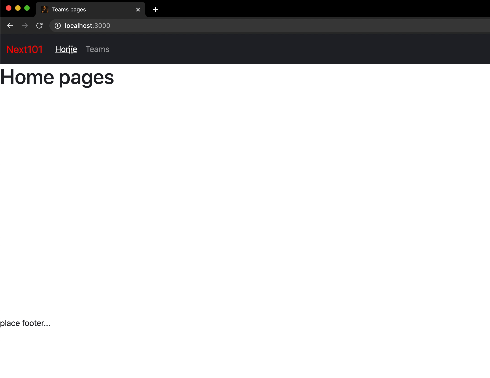

# Nextjs setup project

----



# Todo

- [x] styling with bootstrap
- [x] layout
- [x] router
- [x] dynamic router
- [x] connect to api
- [ ] auth token
- [x] swr
- [ ] manage api
- [ ] try typescript

# Note

### Error 

```text
Warning: Invalid DOM property `crossorigin`. Did you mean `crossOrigin`?
    at link
    at head
    at Head (webpack-internal:///./node_modules/next/dist/pages/_document.js:177:5)
    at html
    at Html (webpack-internal:///./node_modules/next/dist/pages/_document.js:166:29)
    at Document (webpack-internal:///./node_modules/next/dist/pages/_document.js:122:1)

```

### Cause

```js
// fetch cross domain
// localhost cross b0b018d627eafa8c46c6d0910b0896c6.m.pipedream.net

const res = await fetch('https://b0b018d627eafa8c46c6d0910b0896c6.m.pipedream.net/')
const teams = await res.json()
```

### Issue

- https://stackoverflow.com/questions/62331868/wrong-class-names-on-pages-with-different-content-rendered-on-client-than-on-ser